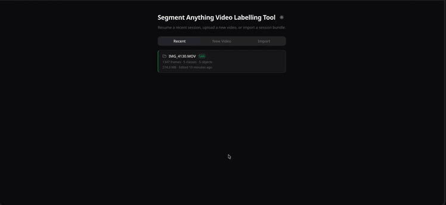

# SAM3 Video Labelling Tool

Annotate videos with [SAM 3.1](https://github.com/facebookresearch/sam3): click, box, or text-prompt an object, propagate its mask across frames, and export datasets for [RF-DETR](https://github.com/roboflow/rf-detr) and other object detection models.

The point of this tool is to use SAM3's segmentation power on your own videos quickly, without going through a third-party labeling service. It's at its best when you have an NVIDIA GPU — locally or as an on-demand L4 on Cloud Run. The Apple Silicon (MPS) build works, but it's too slow for productive annotation; treat it as a way to try the tool, not to do real labeling work.



**New here? Watch the [video walkthrough](https://vimeo.com/1201234232)**, or read the [User Guide](docs/user-guide.md) — both cover every flow: login, upload, click/box/text segmentation, propagation, export, and session resume.

## Features

- **Click, box & text segmentation** — SAM 3.1 generates precise masks from clicks, bounding boxes, or natural-language prompts
- **Mask propagation** — label key frames, propagate forward/backward/both with per-frame confidence; Shift+click to propagate multiple objects in a single SAM3 pass
- **Multi-class, multi-instance** — unlimited annotation classes with color coding and independent object tracking
- **Zoom-to-mask inspect & visual mask deletion** — zoom into any object's bounding box; delete masks by source keyframe and direction with previews
- **Session management** — auto-saves to disk (local) or GCS (cloud); export/import sessions as portable zip bundles
- **COCO export** — standard COCO JSON with bounding boxes and segmentation polygons

## Getting Started

### 1. Request access to the gated model

SAM 3.1 weights are a **gated model** on Hugging Face Hub. The backend downloads them on first use, so do this once before running anywhere:

1. Visit [facebook/sam3](https://huggingface.co/facebook/sam3) and accept the model terms. Access is granted per Hugging Face account.
2. Create a token with **Read** access at [huggingface.co/settings/tokens](https://huggingface.co/settings/tokens) and log in:

```bash
hf auth login        # or: huggingface-cli login (older CLI versions)
```

Alternatively, set the `HF_TOKEN` environment variable before starting the backend.

If you later hit `401 Cannot access gated repo` — even with the model mostly cached, the backend may fetch additional files — your stored token has expired or lost access. Verify with `python3 -c "from huggingface_hub import whoami; print(whoami())"`, re-login with `hf auth login --force`, and retry the action in the UI (no backend restart needed).

### 2a. Run locally

**Prerequisites:** Python 3.11+ with conda/miniforge, Node.js 22+, NVIDIA GPU or Apple Silicon Mac.

```bash
# Backend
conda create -n sam3-annotator python=3.11 -y
conda activate sam3-annotator
cd backend && pip install -r requirements.txt

# Frontend
cd ../frontend && npm install

# Run both
cd .. && make dev   # Flask on :5555, web UI on :5173
```

Device selection is automatic: CUDA on NVIDIA, MPS on Apple Silicon, CPU otherwise. The SAM3 backend is also automatic — the native `facebookresearch/sam3` predictor on CUDA, HuggingFace Transformers elsewhere. Override with `SAM3_DEVICE` and `SAM3_BACKEND` env vars.

With Docker on an NVIDIA machine:

```bash
docker build -t sam3-annotator .
docker run --gpus all -p 8080:8080 -v $(pwd)/data:/data sam3-annotator
```

<details>
<summary><strong>NVIDIA GPU support (which cards work?)</strong></summary>

There's no hardcoded GPU list — the backend detects your card's compute capability at startup and picks the right dtype strategy automatically:

| GPU family | Compute cap | How it runs |
|---|---|---|
| RTX 50-series (Blackwell) | 12.0 | Native bfloat16 — works out of the box |
| RTX 40-series (Ada) | 8.9 | Native bfloat16 — works out of the box |
| RTX 30-series (Ampere) | 8.6 | Native bfloat16 — works out of the box |
| RTX 20-series / GTX 16-series (Turing) | 7.5 | Automatic float16 autocast workaround — works, but ~2.75× slower than native bfloat16 |
| GTX 10-series (Pascal) and older | ≤ 6.1 | Untested — falls into the float16 path but lacks FP16 Tensor Cores; not recommended |

Any RTX 30/40/50 card runs the same native bfloat16 path as the L4/A100 used in production. RTX 20-series uses the same float16 patch built for the T4 (see [blog/sam3-native-cuda-the-dtype-maze.md](blog/sam3-native-cuda-the-dtype-maze.md)). Note the Turing path keeps the weights in float32 (~7 GB on disk), so it needs noticeably more VRAM than the bfloat16 path — the reference cards for each path are the T4 (16 GB) and L4 (24 GB).

</details>

### 2b. Run on Google Cloud

No local GPU? One script provisions everything on Cloud Run with an NVIDIA L4 GPU and a GCS bucket for session storage. The service scales to zero when idle, so you pay (~$0.70/hr) only while annotating.

```bash
# Start: enables APIs, creates registry/buckets/service account, stages the
# SAM3 weights, builds the image, and deploys. Idempotent — safe to re-run.
PROJECT=your-gcp-project ./deploy/deploy.sh up

# It prints the service URL and a generated three-word password at the end.
./deploy/deploy.sh password   # recover the password later
./deploy/deploy.sh status     # show configured + live deployment state
./deploy/deploy.sh smoke      # authenticated smoke checks against the URL

# Stop: deletes the resources the script created.
# (--purge also deletes the GCS buckets — sessions + cached model weights)
./deploy/deploy.sh down
```

You don't need to `down` between annotation sessions — scale-to-zero means an idle service costs nothing for the GPU. `down` is for tearing the deployment away entirely.

Every API request needs an `X-Auth-Token` header matching the deploy-time password; the web UI prompts once per browser. The service runs with `max-instances=1` (SAM3 inference state lives in memory) and `concurrency=8`.

**Full guide: [DEPLOY.md](DEPLOY.md)** — architecture, cost breakdown, IAM/IAP alternatives to the shared password, and troubleshooting. Coding agents get the compact runbook in [deploy/README.md](deploy/README.md).

## Learn More

- [docs/TECHNICAL_REPORT.md](docs/TECHNICAL_REPORT.md) — engineering decisions: the dual SAM3 backend, GPU selection (why L4 and not T4), Cloud Run statefulness, Docker layer caching, MPS constraints
- [docs/MASK_FRAME_STREAMING.md](docs/MASK_FRAME_STREAMING.md) — bandwidth optimizations: RLE masks, version-vector delta sync, IndexedDB caches, SSE propagation streaming
- [blog/](blog/) — longer-form engineering write-ups

## Project Structure

```
backend/
  app/
    routes/          Flask blueprints: video, session, segment, export, status
    services/        SAM3Service, mask/prompt/session storage, GCS sync, pipeline
  tests/             pytest suite
frontend/            React 18 + TypeScript + Vite (shadcn/ui, Tailwind v4)
deploy/              deploy.sh (Cloud Run), nginx.conf, entrypoint.sh
Dockerfile           HuggingFace backend image
Dockerfile.native    Native SAM3 backend image (CUDA, production)
```

## Authors

- **Danilo Gasques** ([@danilogr](https://github.com/danilogr))
- **Claude** (Anthropic — Claude Opus & Claude Fable wrote most of the implementation, working with Claude Code)

## License

[MIT](LICENSE) — provided **as is**, without warranty of any kind. Use at your own risk: this tool was built for internal annotation workflows and is shared in the hope it's useful, not as a supported product. SAM 3.1 model weights are distributed by Meta under their own license terms — review them at [facebook/sam3](https://huggingface.co/facebook/sam3).
