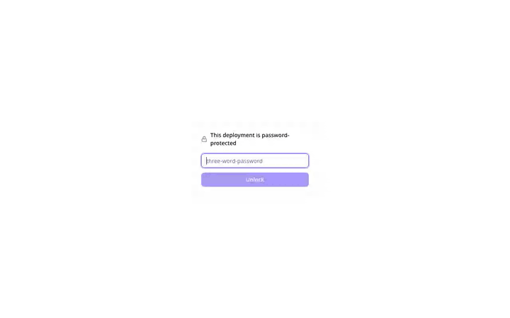
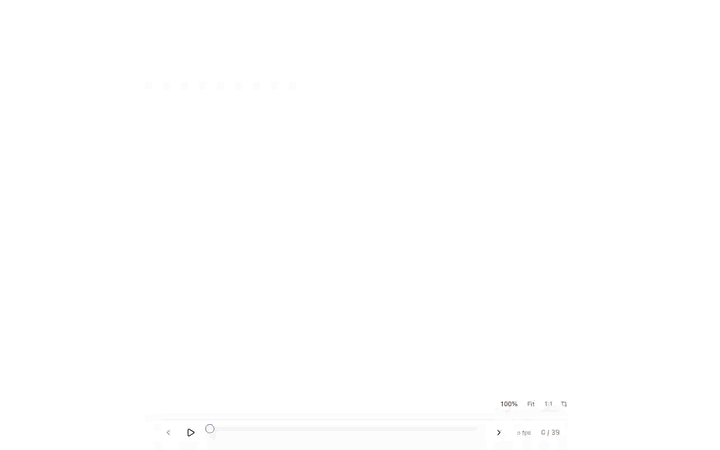
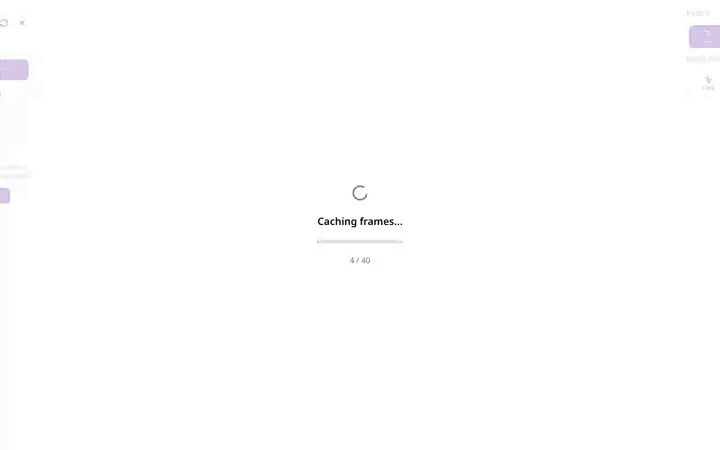

# User Guide

A visual walkthrough of the SAM3 Video Labelling Tool, recorded against a real
Cloud Run deployment. Each section embeds a short animated GIF (sped up
where the app is waiting on the GPU). The clips were captured with the
Playwright recorder in `scripts/user-guide-recorder/` — re-record them any
time with:

```bash
cd scripts/user-guide-recorder && npm install
APP_URL=$(./deploy/deploy.sh status | grep 'url=' | sed 's/.*url=//') \
APP_PASSWORD=$(./deploy/deploy.sh password) \
node record.mjs
../render-user-guide-videos.sh
```

The sample video is the test fixture (`tests/fixtures/harness/sample.mp4`,
an espresso machine — 40 frames), annotated with two objects: the **pressure
gauge** and the **portafilter**.

---

## 1. Logging in



Cloud deployments are protected by a shared three-word password (printed by
`./deploy/deploy.sh up`, recoverable with `./deploy/deploy.sh password`).
Opening the app shows the password gate. A wrong password shows an inline
error and stores nothing; the correct one unlocks the app and is remembered
by the browser (localStorage) — you enter it once per browser.

> First visit after an idle period can take ~60–90 s while the GPU container
> cold-starts. The gate will tell you if the server is still unreachable.

## 2. Uploading a video


*(6× speed)*

From the session list, switch to **New Video**, pick a file, optionally tune
the sampling FPS and max resolution, and press **Upload**. The app extracts
frames, then initializes the SAM3 session — the progress bar walks through
both phases and lands in the annotation UI. Closing the tab during this is
safe: reopening resumes at the right phase.

## 3. Click segmentation


*(1.5× speed)*

Create a class (here: *pressure gauge*), pick the **Click** tool, and
left-click the object on the frame. SAM3 segments it instantly and the mask
appears in the class color. Right-click adds a negative point if the mask
grabs too much. Each click is undoable with **Undo**.

## 4. Box segmentation


*(1.5× speed)*

For elongated or cluttered objects a box prompt is often more precise:
create a class (*portafilter*), pick the **Box** tool, and drag a rectangle
around the object. SAM3 segments the best object inside the box.

## 5. Text detection


*(2× speed)*

The **Detect** tool finds objects from a text description. The input
prefills with the selected class name — type any description (e.g. *pressure
gauge*) and press **Find**. Every match becomes a new object of the selected
class. In the clip the detection is undone afterwards since the gauge was
already annotated by click.

## 6. Propagating one object through the video


*(3× speed)*

Select an object, then press **Forward** (or **Back** / **Both**) in the
propagation bar. SAM3 tracks the object frame by frame; masks stream in live
and the timeline ticks fill with the object color. Frames with low
confidence get amber ticks for review. **Stop** cancels mid-run; progress is
kept.

## 7. Propagating multiple objects together


*(3× speed)*

Shift-click a second object in the object list — chips for every selected
object appear in the propagation bar — then propagate. Both objects are
tracked in a single pass, which is much faster than propagating them one by
one.

## 8. Exporting annotations


*(1.5× speed)*

**Export Annotations** downloads a COCO-format zip (annotated frames +
`_annotations.coco.json` with bboxes and segmentation polygons), ready for
training pipelines like RF-DETR. Only annotated frames are included.

## 9. Closing and resuming a session


*(5× speed)*

Closing a session (X in the sidebar) saves everything — in cloud mode the
session syncs to GCS, so it survives the container scaling to zero. Clicking
the session card later re-downloads it and re-initializes SAM3; all classes,
objects, masks, and tracks come back exactly as you left them.

---

*Related: [DEPLOY.md](../DEPLOY.md) for deploying your own instance ·
[USER-FLOWS.md](../USER-FLOWS.md) for the full flow catalog and verification
harness.*
